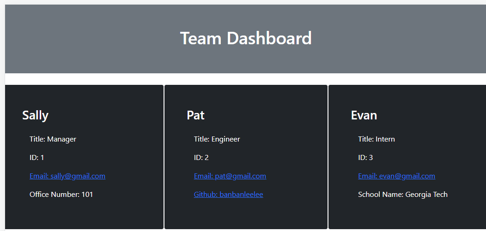

# Team Profile Generator

Hi, this is a simple application that allows users to put in their team member's information for convenience.

## Table Of Contents 
 - [Description](#team-profile-generator)
 - [Installation](#installation-requirements)
 - [Usage](#usage)
 - [Technologies used](#technologies-used)
 - [Contributors](#contributors)
 - [License](#license)
 - [Links](#links)

## Installation Requirements
The required node modules have been included, please input 'npm install' in your terminal to install them.

## Usage
As a team manager, the user can use the command line to input 3 different roles to form a team, including one manager, one or more engineers, and/or one or more interns.
Manager's information includes: name, title, id, email and office number.
Engineer's information includes: name, title, id, email, and GitHub link.
Intern's information includes: name, title, id, email and school name.
The application can be reused for new teams.
  

## Technologies Used
Front End:
* HTML
* CSS
* JavaScript
* jQuery
* Bootstrap

Back End:
* Node.js
* npm
* Jest
* Inquirer

## Contributors
 Sally Zhang
 sallyyixuanzhang@gmail.com

## License
  

## Links
https://banbanleelee.github.io/TeamProfileGenerator/
https://github.com/banbanleelee/TeamProfileGenerator

